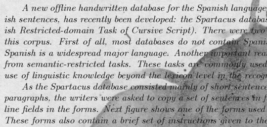
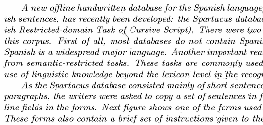
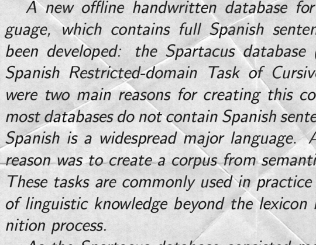
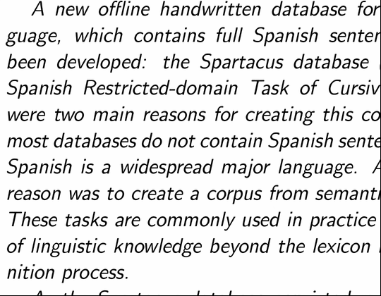
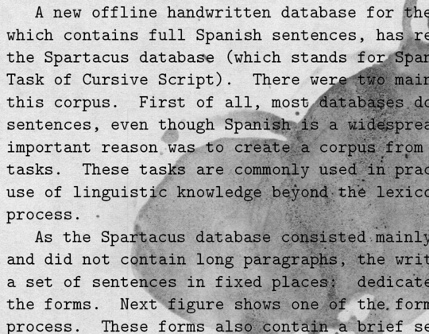
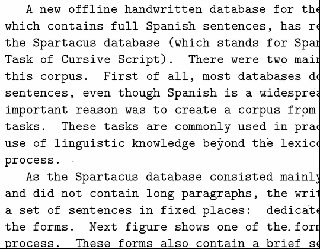

# Denoising Dirty Documents
___
## Purpose
This repository is only for learning some convnet architectures only. \
Try to use AutoEncoder, Unet, and WGAN to remove noises from images.
## Result
|Original|Denoised|
|---     |---     |
|||
|||
|||

